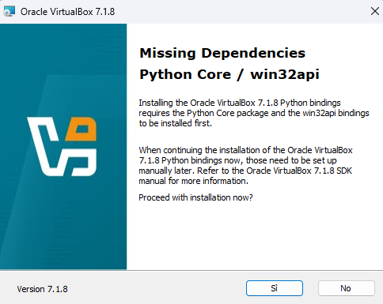
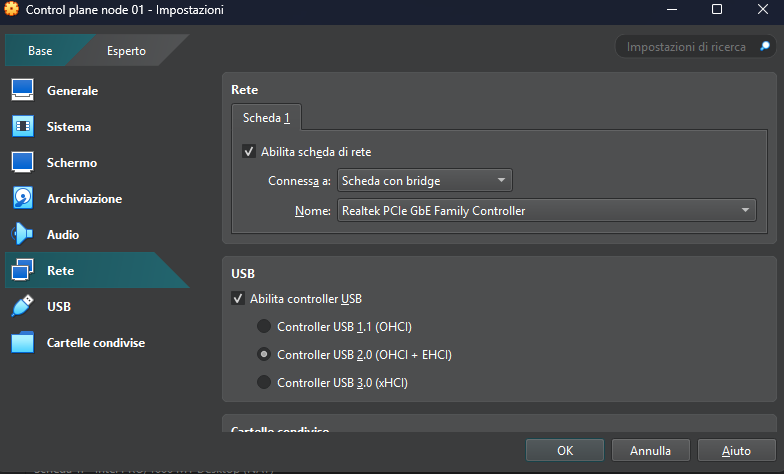
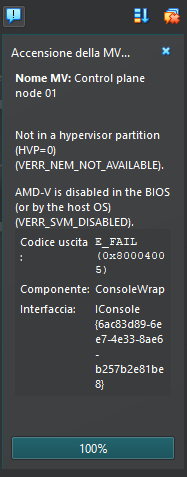
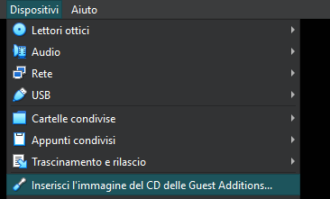

In questa sezione espongo come ho deciso di strutturare l'ambiente in base alle risorse disponibile e come ho installato le Virtual Machine (VM) che ospiteranno il laboratorio.

Il computer che ospiterà le VM con il cluster k8s ha le seguenti caratteristiche:

- Ryzen 5 5600X
- 64Gb RAM
- 220Gb SSD
- 465Gb HDD
- Windows 11 24H2

## Installazione virtualizzatore e VM

Come prima cosa ho installato Virtualbox (https://www.virtualbox.org/wiki/Downloads) v7.1.8 sul disco contente il sistema operativo (SO):

- Seguito il setup senza cambiare niente, alla fine ho ottenuto il seguente errore (sono comunque andato avanti).  
    
- Creata la cartella "VirtualBox VMs" su SSD dedicato al progetto e l'ho impostata come cartella predefinita per le macchine.

Una volta installato Virtualbox ho creato ed installato il SO per le tre VM necessarie per il cluster:

- Scaricato Ubuntu server 24.04.2 LTS (versione server per avere solo la CLI).
- Ridotto range del DHCP sul router in modo da dare indirizzi statici alle macchine.
- VM chiamate Control plane node 01, Worker node 01 e Worker node 02. Saltata l'installazione non supervisionata.
- Fornite 3 CPU e 16384MB (16Gb) RAM, 60GB SSD (crea un disco virtuale ora).
- Impostata scheda di rete con bridge  
    
- Avviata VM ma ho ottenuto un errore.
    - Attivato virtualizzatore (cercare la procedura in base al proprio processore, cambia tra Intel e AMD ed in base alla scheda madre perché bisogna andare nel BIOS):  
        
- Avviata nuovamente la VM e seguito il setup del SO. Scelto layout italiano e lingua inglese, per le impostazioni di rete ho selezionato l'unica interfaccia che avevo disponibile ed inserita come subnet la rete di casa (/24 come suffisso, quindi utilizzato il .0 come indirizzo), come indirizzo ho inserito uno di quelli tolti dal range del DHCP (altrimenti se utilizzato uno che può essere assegnato anche dal DHCP è possibile avere un IP duplicato nella LAN), come gateway e name servers inserito l'IP del router, questo perché è configurato come DNS proxy (altrimenti è possibile mettere come DNS gli IP di Cloudflare o Google).  
    Non impostato né proxy né lvm, hostname (così come username e password) scelto a piacimento, no ubuntu pro, no ssh, no pacchetti selezionati e fatto reboot a fine installazione (da delle failed quando si riavvia ma poi parte premendo invio)

Se non si passa la verifica del mirror significa che ci sono problemi di rete, nel mio caso non avevo messa scheda con bridge alla VM e quindi non andava bene l'IP statico che ho configurato con la scheda di rete assegnata alla VM. L'installazione del SO sulla VM in questione è stata completata con successo dopo aver modificato la scheda ma all'avvio veniva generato un errore di connessione all'url per il check degli aggiornamenti (la connettività ad internet era presente e funzionate), ho eliminato la VM e rifatto tutto da capo, il problema si è risolto.

## Test, aggiornamento SO ed installazione Guest Addition

- Acceduto correttamente con username e password impostati, pingato 8.8.8.8 con successo.
- Aggiornato tutti i pacchetti:
    - sudo apt-get update
    - sudo apt-get upgrade -y
    - sudo apt-get dist-upgrade -y
    - sudo apt-get autoremove -y
    - sudo apt-get install unattended-upgrades
    - sudo apt-get clean
    - reboot

### Installazione Guest Additions (opzionale)

Non vado nel dettaglio perché questo passaggio è necessario se viene installata una GUI e se viene utilizzata la shell che si apre avviando la VM da virtualbox.  
Ho scelto successivamente di utilizzare mRemoteNG per la connessione SSH alle macchine, avrei potuto saltare questo passaggio.

- sudo apt-get update
    
- sudo apt-get upgrade -y
    
- sudo apt-get install -y build-essential dkms linux-headers-$(uname -r)
    
- 
    
- sudo mkdir /media/cdrom
    
- sudo mount /dev/cdrom /media/cdrom
    
- sudo /media/cdrom/VBoxLinuxAdditions.run
    
- lsmod | grep vbox
    
    - vboxguest
    - vboxsf
    - vboxvideo
- sudo reboot
    

## Installazione Kali Linux

Su un altro computer ho installato la VM con Kali Linux:

- Scaricata ISO da https://www.kali.org/get-kali/#kali-installer-images (quello raccomandato).
- Creata VM con 4 CPU, 8Gb RAM, scheda di rete bridge.
- Non impostato dominio, no lvm (unica partizione).
- Per i pacchetti ho lasciato quello che era selezionato (xfce).
- Aggiornati tutti i pacchetti (vedi comandi utilizzati per Ubuntu server).
- Settato ip statico con nmtui (stessa logica utilizzata per Ubuntu server).
- Installati Guest Addons (stessa procedura esposta precedentemente), l'unica differenza è che sudo apt install build-essential dkms linux-headers-$(uname -r) non funziona perché il kernel non è aggiornato, aggiornarlo con il comando apt-get full-upgrade -y. Il comando lsmod mostrerà soltanto i moduli vboxguest e vboxsf, il servizio vboxaddservice-service è in failed (problema non bloccante, non l'ho risolto). Testato copia/incolla da host windows e ridimensionamento, funziona tutto correttamente.

## Passwordless sudo

Per praticità ho fatto in modo che il mio utente potesse utilizzare sudo senza aver bisogno di inserire la password. Ho modificato il file /etc/sudoers aggiungendo in fondo la seguente riga:

nox ALL=(ALL) NOPASSWD: ALL