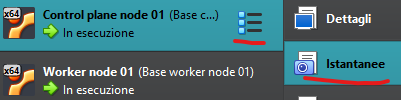

In questa sezione espongo come ho abilitato l'accesso in SSH alle varie VM (non fatto sulla Kali perché al momento penso che la utilizzerò sempre lanciando il terminale da GUI o usando l'interfaccia grafica dei vari tools).  
Ho scelto di usare mRemoteNG perché è uno strumento che conosco già.

## Accesso SSH alle macchine tramite mRemoteNG

Altrimenti non è possibile fare copia-incolla sulle VM del cluster, inoltre posso connettermi in ssh dalla macchina dove ho la VM Kali.

Su entrambe le macchine fisiche (Windows) ho installato mRemoteNG (che in realtà è un portable), https://mremoteng.org/download (stable). Scompattato nella directory x86 e creato collegamento sul desktop.

Ho poi modificato i file host sulle macchine Windows (C:\\Windows\\System32\\drivers\\etc) definendo un nome mnemonico per ogni VM da associare al rispettivo IP statico che ho impostato precedentemente (control1, worker1, worker2, kali). In questo modo posso utilizzare quel nome mnemonico che verrà risolto nell'IP corretto (ad es. posso fare ping control1 oppure impostare la connessione da mRemoteNG utilizzando worker2 invece del suo IP). Attenzione a non sbagliare la sintassi, con un tab tra l'IP ed il nome non funziona, lasciare uno spazio.

Sulle VM del cluster:

- sudo apt-get install openssh-server -y
    
- sudo systemctl enable ssh
    
- sudo systemctl start ssh
    
- sudo systemctl status ssh
    
- reboot per testare che si avvii il servizio correttamente.
    
- Modificato file host (/etc/hosts) per fare le stesse associazioni fatte sulle macchine Windows.
    
- Provato ping e connessione tramite mRemoteNG.
    

&nbsp;

## Snapshot

Utili da fare prima di grandi cambiamenti che potrebbero compromettere la funzionalità del cluster, invece di ripartire da 0 posso ripartire da un punto a mio piacimento.  
Non ho previsto un sistema particolare di backup, al momento utilizzo la funzionalità di Virtualbox per fare lo snapshot quando lo ritengo necessario.

Il primo snapshot riguarda quindi le VM installate ed aggiornate prima di installarci il cluster k8s.