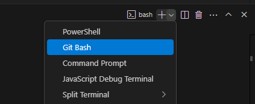

In questa sessione espongo come ho deciso di struttura la documentazione ed il repository con configurazioni/scripts etc.

## VS Code e Git

### Installazione

- Installato vscode (https://code.visualstudio.com/download), seguito il setup lasciando tutto di default.
- Installato git (https://git-scm.com/downloads):
    - Tutto default tranne selezionato visual studio code come git default editor, come nome del default branch messo main, utilizzo OpenSSL library.

### Repository configurazioni/scripts

- Creata directory in locale.
- Creato .gitignore vuoto.
- git init dentro la directory creata
- git add .
- git commit -m "commento"
    - Però chiede di settare le variabili globali:
        - git config --global user.email "mia_email"
        - git config --global user.name "mio_username"
- git commit -m "commento"
- Creato repo privato su github.
- Creato README.md con breve descrizione e commitato.
- git remote add origin git@github.com:username/nome_repo_privato.git (seguire la documentazione di Github che compare a valle della creazione del repo privato considerandola parte per SSH, git branch -M main non necessario perché il branch si chiama già main avendo installato così il git).
- ssh-keygen -t ed25519 -C "mia_email" (da CLI Windows).
- Messa (chiave pubblica) su github (Profilo in alto a dx, poi Settings ed infine SSH and GPG keys e cliccare su New SSH key).
- test con ssh -T git@github.com

Impostata shell bash come default in vscode:  

## Repository per documentazione

- Creata directory devsecops-lab-docs + progetto pubblico su github
- cd devsecops-lab-docs
- Installato python sul computer (3.13.3), spuntate "Use admin privileges when installing py.exe e Add python.exe to PATH", disabilitato il PATH limit.
- pip install mkdocs mkdocs-material
- mkdocs new .